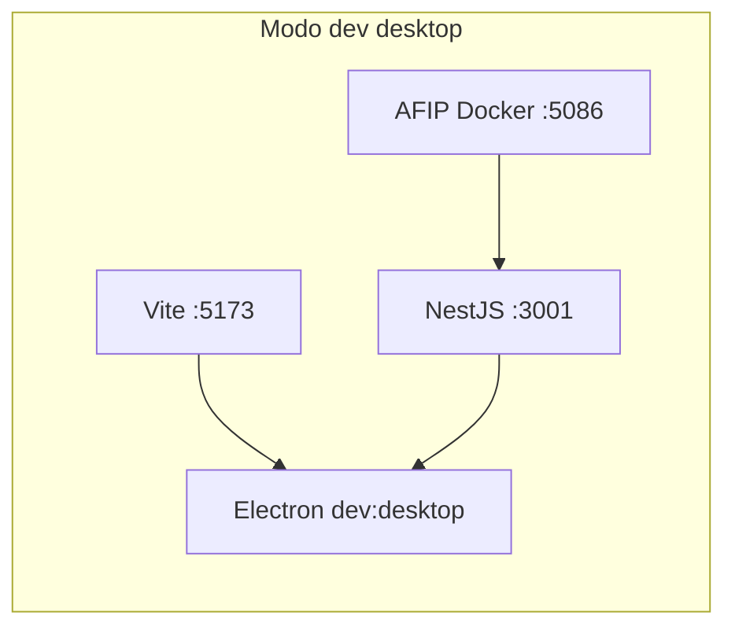
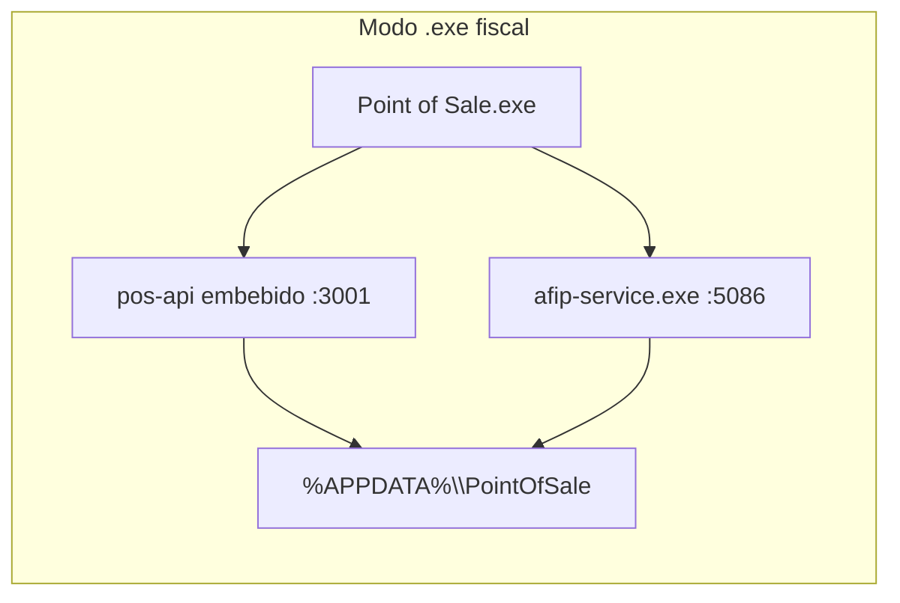

# Plan: App de escritorio (dev Electron + .exe fiscal)

## Estado actual de tu máquina

| Requisito                                                                   | Estado                                   |
| --------------------------------------------------------------------------- | ---------------------------------------- |
| `node_modules` (raíz, frontend, backend, desktop)                           | OK                                       |
| BD dev [`backend/storage/database.sqlite`](backend/storage/database.sqlite) | OK                                       |
| [`backend/dist/main.js`](backend/dist/main.js)                              | OK                                       |
| [`desktop/resources/nodejs/node.exe`](desktop/resources/nodejs/node.exe)    | OK                                       |
| Docker Desktop                                                              | OK                                       |
| `.exe` compilado                                                            | **No existe** (`desktop/release/` vacío) |
| `afip-service.exe`                                                          | **No existe** (`services/afip/dist/`)    |

---

## Parte 1 — Ver la app como escritorio en desarrollo (no web)

Esto abre una **ventana Electron nativa** (1440×900, barra de título de Windows, sin pestañas del navegador). El frontend sigue en hot-reload vía Vite.



### Comandos (2 terminales desde la raíz del repo)

**Terminal 1** — stack completo (UI + API con hot-reload + AFIP):

```powershell
cd "C:\Users\ticia\OneDrive\Sistemas\Point_of_Sale"
npm run dev:stack
```

Esperar hasta ver Vite en `:5173` y la API respondiendo.

**Terminal 2** — shell Electron:

```powershell
cd "C:\Users\ticia\OneDrive\Sistemas\Point_of_Sale"
npm run dev:desktop
```

### Qué esperar

- Se abre **Point of Sale** como app de Windows (no abrir `http://localhost:5173` en Chrome).
- La UI es la misma que en web, pero dentro del contenedor Electron con APIs de impresión (`print-receipt`, `list-printers` vía [`desktop/src/preload.ts`](desktop/src/preload.ts)).
- Electron intenta levantar un backend propio en `:3001`; si `dev:stack` ya lo tiene activo, el segundo proceso puede fallar en el puerto pero la UI funciona porque la API del stack ya responde (comportamiento documentado en [`docs/ai/dev-runbook.md`](docs/ai/dev-runbook.md) §3).
- Datos: con `dev:stack` activo, la API usa [`backend/storage/`](backend/storage/) (misma BD que desarrollo web).

### Verificación rápida

```powershell
Invoke-RestMethod http://127.0.0.1:3001/api
Invoke-RestMethod http://127.0.0.1:5086/api/afipws/test
```

---

## Parte 2 — Compilar y ejecutar el `.exe` fiscal

Elegiste la variante **fiscal** (`dist:win:fiscal`): empaqueta frontend + backend + `afip-service.exe` sidecar.

### Paso 2.1 — Build del sidecar AFIP (primera vez, ~5–15 min)

Requisito: **Python 3.11+** instalado y en PATH.

```powershell
cd "C:\Users\ticia\OneDrive\Sistemas\Point_of_Sale"
npm run build:afip-sidecar
```

- Clona `servicio_afip` en [`services/afip/source/`](services/afip/source/) si no existe.
- Genera [`services/afip/dist/afip-service.exe`](services/afip/dist/afip-service.exe).

### Paso 2.2 — Build completo + empaquetado

```powershell
cd "C:\Users\ticia\OneDrive\Sistemas\Point_of_Sale"
npm run dist:win:fiscal
```

Esto ejecuta en cadena: `build:web` + `build:api` + `build:desktop` + sidecar + `electron-builder`.

**Salida esperada:**

- Ejecutable sin instalar: `desktop/release/win-unpacked/Point of Sale.exe`
- Instalador NSIS: `desktop/release/Point of Sale-0.0.1-win-x64.exe`
- Portable: `desktop/release/Point of Sale-0.0.1-portable.exe`

### Paso 2.3 — Inicializar BD de producción (obligatorio antes del primer arranque)

El `.exe` usa datos en `%APPDATA%\PointOfSale\`, **no** `backend/storage/`:

```powershell
cd "C:\Users\ticia\OneDrive\Sistemas\Point_of_Sale\backend"
$env:APP_DATA_DIR = "$env:APPDATA\PointOfSale"
npm run db:init
```

Primera apertura: pantalla **Configuración inicial** para crear el administrador.

### Paso 2.4 — Ejecutar el `.exe`

```powershell
& "C:\Users\ticia\OneDrive\Sistemas\Point_of_Sale\desktop\release\win-unpacked\Point of Sale.exe"
```

O doble clic en el archivo desde el Explorador.

En modo empaquetado:

- Electron spawnea **pos-api** + {



- **No requiere Docker** ni `dev:stack`.
- Certificados AFIP (si los tenés): copiar `user.crt` y `user.key` a `%APPDATA%\PointOfSale\afip\`.

---

## Riesgos y mitigaciones (OneDrive)

Tu repo está en OneDrive (`C:\Users\ticia\OneDrive\...`). Builds de Electron suelen fallar con `EBUSY` / `EPERM`.

**Si `dist:win:fiscal` falla**, build alternativo fuera de OneDrive:

```powershell
cd "C:\Users\ticia\OneDrive\Sistemas\Point_of_Sale\desktop"
$env:CSC_IDENTITY_AUTO_DISCOVERY = 'false'
npx electron-builder --win --config electron-builder.fiscal.yml --config.directories.output=C:/Temp/pos-build
```

Luego ejecutar: `C:\Temp\pos-build\win-unpacked\Point of Sale.exe`

**Nota técnica:** [`desktop/electron-builder.fiscal.yml`](desktop/electron-builder.fiscal.yml) no embebe `nodejs/node.exe` (a diferencia del build estándar). El arranque del backend en `.exe` fiscal usa Node del sistema o `ELECTRON_RUN_AS_NODE` como fallback ([`desktop/src/local-services.ts`](desktop/src/local-services.ts)). Si el `.exe` no arranca la API, verificar que `node` esté en PATH o considerar agregar el recurso `nodejs/node.exe` al yml fiscal.

---

## Orden de ejecución propuesto (al confirmar el plan)

1. Levantar `dev:stack` + `dev:desktop` → revisar UI en ventana Electron.
2. Compilar sidecar AFIP (`build:afip-sidecar`).
3. Compilar instalador fiscal (`dist:win:fiscal`).
4. `db:init` con `APP_DATA_DIR` apuntando a AppData.
5. Lanzar `Point of Sale.exe` y comparar con la ventana dev.
