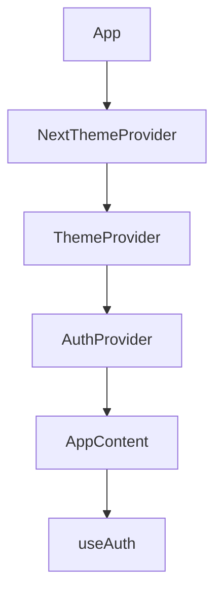
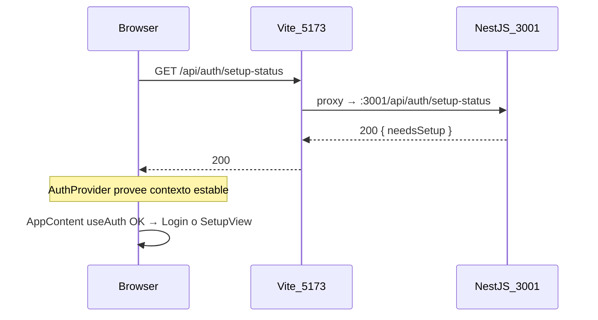

# Plan: corregir `useAuth` y errores 500 de API

## Diagnóstico

### Error 1 — `useAuth debe usarse dentro de AuthProvider`

El árbol en [`frontend/src/app/App.tsx`](frontend/src/app/App.tsx) **está correcto**: `AppContent` se renderiza **dentro** de `AuthProvider`.



[`frontend/src/lib/auth-context.tsx`](frontend/src/lib/auth-context.tsx) lanza el error solo cuando `useContext(AuthContext)` devuelve `null`. Si React muestra `AuthProvider` como ancestro y aun así falla, la causa típica es **dos instancias distintas de `AuthContext`** en memoria:

- El stack incluye `@react-refresh` y varios timestamps (`?t=1782272181148`, `?t=1782272184166`, etc.) → indica **Hot Module Replacement (HMR)** activo mientras se editaba `auth-context.tsx` o `App.tsx`.
- En dev, cuando un archivo exporta **componente + hook + `createContext`**, Vite puede recargar el módulo, crear un `AuthContext` nuevo, y dejar consumidores (`useAuth`) apuntando al contexto viejo.

**Conclusión:** no es un bug de jerarquía en `App.tsx`; es inestabilidad de HMR (o, menos frecuente, backend caído + recargas parciales en cascada).

### Error 2 — `GET /api/*` → 500

Las peticiones van a `http://localhost:5173/api/...` y el proxy de [`frontend/vite.config.ts`](frontend/vite.config.ts) las reenvía a `http://127.0.0.1:3001`.

Endpoints afectados (todos **públicos** en backend):

- `/api/auth/setup-status` → [`backend/src/auth/auth.controller.ts`](backend/src/auth/auth.controller.ts)
- `/api/license/status` → [`backend/src/license/license.controller.ts`](backend/src/license/license.controller.ts)
- `/api/settings/theme` → [`backend/src/settings/settings.controller.ts`](backend/src/resources/settings/settings.controller.ts)

Si **todos** devuelven 500, lo más probable es que **el backend NestJS no esté corriendo** o **esté crasheando al arrancar** (no un problema de JWT/licencia en esas rutas).

El error de tema en [`frontend/src/lib/theme-context.tsx`](frontend/src/lib/theme-context.tsx) es consecuencia: `PosAPI.getThemeConfig()` falla y solo hace `console.error` (no rompe la app).

El bootstrap de auth en [`frontend/src/lib/auth-context.tsx`](frontend/src/lib/auth-context.tsx) atrapa el fallo de `getSetupStatus()` y hace `logout()`, pero la app debería seguir mostrando login/setup — **salvo** que el error de `useAuth` por HMR tumbe el render antes.

---

## Pasos de verificación (sin tocar código)

1. **Detener** procesos Vite/NestJS previos (Ctrl+C en terminales).

2. **Levantar stack completo** desde la raíz del repo:

   ```powershell
   npm run dev:stack
   ```

   Alternativa equivalente: dos terminales con `npm run dev:api` y `npm run dev:web`.

3. **Health checks** (PowerShell):

   ```powershell
   Invoke-RestMethod http://127.0.0.1:3001/api
   Invoke-RestMethod http://127.0.0.1:3001/api/auth/setup-status
   Invoke-RestMethod http://127.0.0.1:3001/api/license/status
   Invoke-RestMethod http://127.0.0.1:3001/api/settings/theme
   ```

   - Si fallan aquí → problema de backend (no de React).
   - Si responden OK pero el navegador sigue en 500 → revisar que el proxy apunte a `:3001`.

4. **Hard refresh** del navegador (Ctrl+Shift+R) en `http://localhost:5173`.

5. Si el backend no arranca, revisar en la terminal de `dev:api`:
   - Falta BD: `cd backend; npm run db:init`
   - Falta `.env`: copiar `backend/.env.example` → `backend/.env`
   - Cambio reciente a builder SWC en [`backend/nest-cli.json`](backend/nest-cli.json) — verificar que `nest start --watch` compile sin errores de paths `@/`

---

## Cambios de código propuestos (si persiste tras reinicio)

### A. Estabilizar contexto de auth ante HMR (recomendado)

Separar el contexto del provider para que Fast Refresh no invalide el `createContext`:

| Archivo nuevo                                                              | Contenido                           |
| -------------------------------------------------------------------------- | ----------------------------------- |
| [`frontend/src/lib/auth-context.ts`](frontend/src/lib/auth-context.ts)     | `createContext`, tipos, `useAuth()` |
| [`frontend/src/lib/auth-provider.tsx`](frontend/src/lib/auth-provider.tsx) | `AuthProvider` con lógica de sesión |

Actualizar imports en:

- [`frontend/src/app/App.tsx`](frontend/src/app/App.tsx)
- [`frontend/src/app/components/auth/LoginView.tsx`](frontend/src/app/components/auth/LoginView.tsx)
- [`frontend/src/app/components/auth/SetupView.tsx`](frontend/src/app/components/auth/SetupView.tsx)
- [`frontend/src/app/components/layout/Header.tsx`](frontend/src/app/components/layout/Header.tsx)
- [`frontend/src/app/components/settings/UserRolesSettings.tsx`](frontend/src/app/components/settings/UserRolesSettings.tsx)

**Alternativa mínima** (si no se quiere split): añadir al tope de `auth-context.tsx`:

```ts
// @refresh reset
```

Fuerza remount completo al editar el archivo; menos elegante pero rápido.

### B. Mejorar UX cuando la API no está disponible (opcional, bajo impacto)

En [`frontend/src/lib/auth-context.tsx`](frontend/src/lib/auth-context.tsx) (o el nuevo provider), distinguir en bootstrap:

- `needsSetup` / login normal cuando la API responde
- estado `apiUnavailable: true` cuando `fetch` falla por red/500 del proxy

En [`frontend/src/app/App.tsx`](frontend/src/app/App.tsx), mostrar pantalla tipo _"No se pudo conectar con la API en :3001. Ejecutá npm run dev:api"_ en lugar de depender solo de errores en consola.

### C. Backend — solo si health checks fallan

Investigar logs de arranque; puntos sensibles recientes en el repo:

- Migración a **SWC** en [`backend/nest-cli.json`](backend/nest-cli.json)
- [`backend/src/filters/audit-exception.filter.ts`](backend/src/filters/audit-exception.filter.ts) (convierte excepciones no-HTTP en 500 genérico)
- Licencia: [`backend/src/license/license.service.ts`](backend/src/license/license.service.ts) carga `license-public.pem` al construir el servicio

No tocar guards: `@PublicRoute()` ya exime correctamente `setup-status`, `license/status` y `settings/theme`.

---

## Resultado esperado



- Sin error `useAuth debe usarse dentro de AuthProvider` tras reinicio + hard refresh.
- `/api/*` responde 200 (o 401 solo en rutas protegidas sin token).
- UI muestra SetupView (BD vacía), LoginView (sin sesión) o POS (con sesión válida).

## Orden de ejecución recomendado

1. Verificar y levantar backend (`dev:stack` o `dev:api`).
2. Hard refresh del navegador.
3. Si `useAuth` sigue fallando **sin editar archivos en caliente** → aplicar split de contexto (A).
4. Si la API sigue en 500 con backend “up” → depurar arranque NestJS (C).
