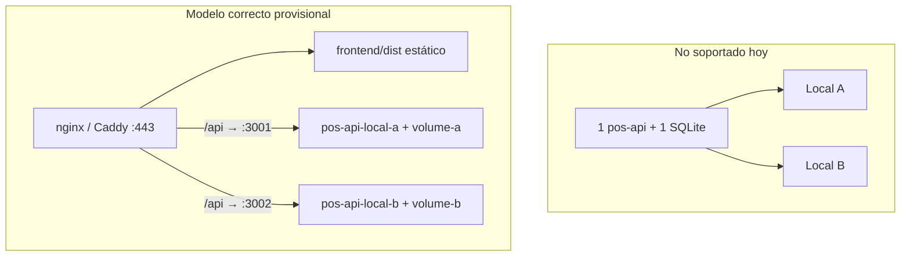
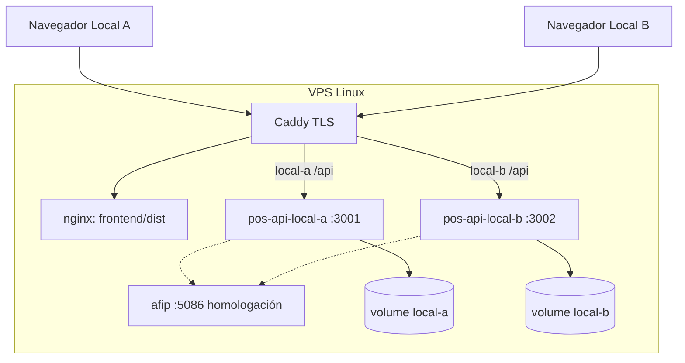

# Despliegue provisional POS web en Linux (2 locales / 2 cajas)

## Revisión del estado actual

### Lo que ya existe y sirve

| Pieza               | Ubicación                                                                                                           | Uso en staging                                                          |
| ------------------- | ------------------------------------------------------------------------------------------------------------------- | ----------------------------------------------------------------------- |
| API containerizable | [`backend/Dockerfile`](backend/Dockerfile) + [`docker-compose.dev.yml`](docker-compose.dev.yml) (`pos-api`, `afip`) | Base para instancias en Linux                                           |
| Frontend web        | [`frontend/`](frontend/) — `getApiBaseUrl()` devuelve `/api` cuando se sirve por HTTP                               | Un solo build estático + nginx proxy                                    |
| Auth multi-usuario  | JWT + roles `admin` / `cashier` (Sprint 4 MVP)                                                                      | Admin por local + cajero dedicado                                       |
| AFIP en Docker      | [`services/afip/Dockerfile`](services/afip/Dockerfile)                                                              | Opcional en homologación; no obligatorio para probar ventas/caja        |
| Relay remoto        | [`docker-compose.remote.yml`](docker-compose.remote.yml)                                                            | **Opcional** fase 2 (supervisión central); no requerido para que vendan |

### Limitaciones importantes (revisión honesta)



1. **No hay multi-sucursal en una sola BD** — cada local necesita su propia instancia `pos-api` con volumen SQLite separado (`APP_DATA_DIR` distinto).
2. **El relay remoto no modela `locations`** — solo `tenant` + `registers`; las “sucursales” en staging se distinguen por **subdominio/instancia**, no por entidad en relay ([`services/remote/src/store/memory-store.ts`](services/remote/src/store/memory-store.ts)).
3. **No hay `docker-compose` de producción web** — solo dev ([`docker-compose.dev.yml`](docker-compose.dev.yml)) y relay ([`docker-compose.remote.yml`](docker-compose.remote.yml)).
4. **`db:init` no corre automáticamente** en el contenedor — hay que ejecutarlo al primer deploy ([`backend/src/database/init-db.ts`](backend/src/database/init-db.ts)).
5. **Licencia** — en staging usar `DEV_SKIP_LICENSE=true` o clave `DEV-LICENSE-UNLIMITED` ([`docs/ai/licensing.md`](docs/ai/licensing.md)).
6. **Ruta de datos en Linux prod** — sin `APP_DATA_DIR`, Node usa `~/.pointofsale` ([`backend/src/config/desktop-paths.ts`](backend/src/config/desktop-paths.ts)); en Docker **siempre** fijar `APP_DATA_DIR=/data`.

### Recomendación de runtime (elegiste “sin definir”)

**Opción más simple para probar:** cada local abre un **navegador** (PC, tablet o notebook) en su URL:

- `https://local-a.tu-dominio.com` → cajero del Local A
- `https://local-b.tu-dominio.com` → cajero del Local B

No hace falta `.exe` ni Electron para esta fase. El `.exe` sigue siendo el camino de producción en mostrador Windows ([`docs/casos-de-uso/06-desplegar-caja.md`](docs/casos-de-uso/06-desplegar-caja.md)).

---

## Arquitectura objetivo (staging)



**Datos por local (aislados):**

| Local                | URL         | Volumen            | Usuarios previstos               |
| -------------------- | ----------- | ------------------ | -------------------------------- |
| Local A (ej. Centro) | `local-a.*` | `pos-data-local-a` | `admin.centro` + `cajero.centro` |
| Local B (ej. Norte)  | `local-b.*` | `pos-data-local-b` | `admin.norte` + `cajero.norte`   |

Cada local = negocio/catálogo/ventas/caja **independientes** (como dos instalaciones separadas).

---

## Qué vamos a crear en el repo

### 1. `docker-compose.staging.yml` (raíz)

Servicios:

- **`afip`** — reutilizar build de [`services/afip`](services/afip); `PRODUCTION=FALSE`; puerto interno; compartido (homologación).
- **`pos-api-local-a`** / **`pos-api-local-b`** — build [`backend/Dockerfile`](backend/Dockerfile), cada uno con:
  - `HOST=0.0.0.0`
  - `NODE_ENV=production`
  - `APP_DATA_DIR=/data`
  - `CORS_ORIGIN=https://local-a.tu-dominio.com` (o `*` provisional)
  - `AFIP_SERVICE_URL=http://afip:8002`
  - `JWT_SECRET` distinto o compartido (mejor distinto por instancia)
  - `DEV_SKIP_LICENSE=true`
  - `REMOTE_ENABLED=false` (activar después si hace falta)
- **`web`** — imagen `nginx:alpine` montando `frontend/dist` + config con dos `server` blocks.
- **Entrypoint** ligero en backend (script `scripts/docker-entrypoint.sh`): si no existe `database.sqlite`, ejecutar `node dist/database/init-db` equivalente / `npm run db:init` compilado.

Puertos expuestos al host: solo **80/443** vía Caddy (APIs no públicas directamente).

### 2. Config reverse proxy

- [`deploy/staging/Caddyfile.example`](deploy/staging/Caddyfile.example) — TLS + rutas a nginx y APIs (patrón similar a [`services/remote/Caddyfile.example`](services/remote/Caddyfile.example)).
- [`deploy/staging/nginx.conf`](deploy/staging/nginx.conf) — SPA fallback `try_files`, proxy `/api` al servicio correcto por `server_name`.

### 3. Variables de entorno

- [`deploy/staging/.env.example`](deploy/staging/.env.example) — dominios, secrets, flags AFIP/licencia.
- Documentar que **no se commitean** `.env` ni certificados.

### 4. Guía operativa

Nuevo caso de uso [`docs/casos-de-uso/07-despliegue-linux-staging.md`](docs/casos-de-uso/07-despliegue-linux-staging.md) con:

1. Requisitos VPS (Ubuntu 22.04+, Docker, DNS `local-a` / `local-b`).
2. Build en servidor o CI: `npm run build:web` + `npm run build --prefix backend`.
3. `docker compose -f docker-compose.staging.yml up -d --build`.
4. **Bootstrap por local** (manual, primera vez):
   - Abrir URL → pantalla **Configuración inicial** (`SetupView`) → crear admin.
   - Login admin → Usuarios → crear cajero (`role: cashier`).
   - Login cajero → abrir sesión de caja → venta de prueba.
5. Verificación:

```bash
curl -s https://local-a.tu-dominio.com/api
curl -s https://local-b.tu-dominio.com/api
```

6. Tabla de troubleshooting (CORS, 502, BD vacía, licencia, AFIP caído).

### 5. Script opcional de ayuda

- [`scripts/staging-bootstrap.sh`](scripts/staging-bootstrap.sh) — valida health, imprime checklist de setup por local (sin automatizar contraseñas en repo).

---

## Flujo de prueba end-to-end (checklist)

1. Deploy stack en VPS.
2. **Local A:** setup admin → crear `cajero.centro` → abrir caja → vender 1 producto.
3. **Local B:** mismo flujo con usuarios distintos.
4. Confirmar que ventas de A **no** aparecen en B (aislamiento SQLite).
5. (Opcional) Importar catálogo desde CSV/export existente (`exports/elixia/`) en cada local por separado.
6. (Opcional fase 2) Levantar relay + portal para ver ambas cajas online.

---

## Riesgos y decisiones explícitas

| Tema                 | Riesgo                                            | Mitigación staging                                                       |
| -------------------- | ------------------------------------------------- | ------------------------------------------------------------------------ |
| AFIP                 | Factura real no probada sin certificados          | Homologación o desactivar facturación en pruebas                         |
| Relay in-memory      | Se pierde estado al reiniciar                     | No crítico si solo probamos POS web                                      |
| `base: './'` en Vite | Rutas SPA en subdominio                           | Probar `try_files`; si falla, añadir `build:web:staging` con `base: '/'` |
| Seguridad            | JWT por defecto, sin MFA                          | Secrets fuertes en `.env`; HTTPS obligatorio                             |
| Impresión            | Web usa diálogo del navegador, no térmica ESC/POS | Esperado; documentar en la guía                                          |
| Producción real      | Linux web ≠ modelo `.exe` offline-first           | Este staging valida UI/API; producción mostrador sigue siendo Electron   |

---

## Fuera de alcance (esta iteración)

- Multi-sucursal en una sola BD (cambio de producto/arquitectura).
- PostgreSQL en relay (MVP sigue en memoria).
- Automatizar creación de usuarios vía script con contraseñas en git.
- CI/CD completo a VPS (solo documentar comandos manuales).
