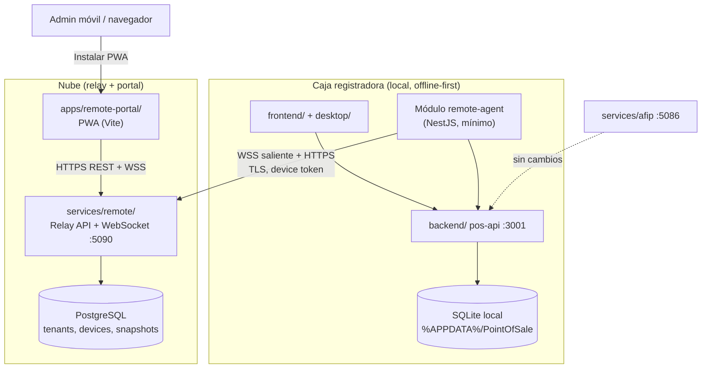
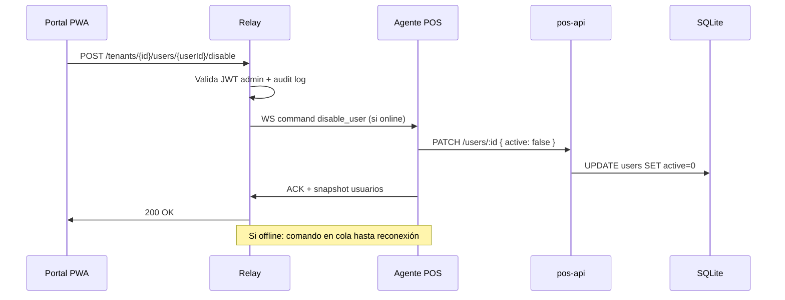

# Conectividad remota — arquitectura y diseño

**Última actualización:** 2026-06-18  
**Estado:** MVP scaffold implementado (2026-06-18)  
**Sprint planificado:** [Sprint 7 en `sprint-revision.md`](./sprint-revision.md#sprint-7--conectividad-remota--pwa)

---

## 1. Problema y objetivos

### Problema

Hoy cada instalación POS (`.exe` + SQLite local) opera de forma **aislada**. No hay forma de que un administrador central:

- Vea precios, ventas o estado de caja **sin estar físicamente en el local**
- Supervise **varias sucursales o cajas** desde un solo lugar
- **Habilitar o deshabilitar usuarios** de cajeros cuando alguien deja la empresa o hay un incidente
- Instalar una **app en el celular** (PWA) para consultas rápidas sin depender del escritorio del local

### Objetivos

| Objetivo | Descripción |
|----------|-------------|
| **Visibilidad remota** | Resúmenes de ventas, precios, stock bajo y estado de caja por local, varios locales o todos |
| **Multi-sucursal / multi-caja** | Un cliente (tenant) puede tener N locales y M cajas; dashboard central + vista por caja |
| **Administración remota acotada** | Habilitar/deshabilitar usuarios locales; **no** reemplazar el POS ni exponer SQLite |
| **Offline-first** | El POS sigue vendiendo sin internet; la sincronización es eventual |
| **Separación de responsabilidades** | Microservicio de relay en la nube, agente mínimo en NestJS, PWA aparte — mismo patrón que AFIP |

### No objetivos (MVP)

- Editar catálogo completo o registrar ventas remotamente (solo lectura + comandos de admin acotados)
- Sincronización bidireccional de inventario en tiempo real
- Reemplazar AFIP ni tocar certificados fiscales
- Abrir SQLite al internet

---

## 2. Diagrama de arquitectura



### Flujo de datos (resumen)

```text
1. Admin crea tenant en portal → obtiene número de cliente + código de emparejamiento
2. POS (admin local) escanea QR / ingresa código → agente registra device_id + secret en AppData
3. Agente abre WebSocket saliente al relay (no requiere puerto entrante en el local)
4. Agente envía heartbeat + cola de eventos (resúmenes, alertas)
5. Portal consulta relay (nunca SQLite); comandos remotos (ej. deshabilitar usuario) via relay → agente → API local
```

---

## 3. Componentes

### 3.1 `services/remote/` — microservicio relay (nube)

| Aspecto | Decisión |
|---------|----------|
| **Rol** | Hub de sincronización: registro de dispositivos, WebSocket, API REST para el portal, almacén de snapshots |
| **Stack recomendado** | **Node.js 20 + Fastify** + `@fastify/websocket` + **PostgreSQL** |
| **Puerto dev** | `5090` (paralelo a AFIP `5086`, API `3001`) |
| **Por qué Node y no FastAPI** | Monorepo ya es TypeScript; tipos compartidos con portal y agente; despliegue Docker homogéneo con AFIP wrapper |
| **Por qué WebSocket y no MQTT** | El portal PWA y el agente POS necesitan canal browser↔nube; MQTT añade broker extra sin beneficio claro en MVP; WSS saliente desde el local evita NAT |
| **Qué NO hace** | Lógica de negocio POS, facturación, acceso directo a SQLite del cliente |

Estructura propuesta (futura):

```text
services/remote/
├── README.md
├── Dockerfile
├── .env.example
├── package.json
└── src/
    ├── main.ts              # Fastify + WS
    ├── auth/                # JWT portal + device tokens
    ├── tenants/             # client_id, locations, registers
    ├── devices/             # pairing, heartbeat
    ├── snapshots/           # precios, resúmenes, alertas
    └── commands/            # cola de comandos hacia POS
```

### 3.2 `apps/remote-portal/` — PWA administración

| Aspecto | Decisión |
|---------|----------|
| **Rol** | Dashboard móvil: login admin, selector tenant/local/caja, vistas de resumen, gestión de usuarios remotos |
| **Stack** | React + Vite + **vite-plugin-pwa** + Tailwind (alineado a `frontend/`) |
| **Instalación móvil** | Manifest + service worker → “Agregar a pantalla de inicio” |
| **Hosting** | Build estático; ver §8 |

Estructura propuesta:

```text
apps/remote-portal/
├── README.md
├── package.json
├── vite.config.ts           # base: '/' para hosting en subdominio
├── public/manifest.webmanifest
└── src/
    ├── pages/               # Dashboard, Locations, Registers, Users
    └── lib/remote-api.ts    # cliente HTTP al relay
```

### 3.3 Cambios mínimos en `backend/` (agente local)

Nuevo módulo NestJS **`remote-agent`** — **no duplica** productos/ventas/caja:

| Responsabilidad | Implementación |
|-----------------|----------------|
| Emparejamiento | `POST /api/remote/pair` (admin local, rol `admin`) — consume código QR del relay |
| Estado | `GET /api/remote/status` — conectado, último sync, device_id |
| Heartbeat | Job interno cada N segundos → WSS al relay |
| Push de snapshots | Lee `ProductsService`, `SalesService`, `CashService` → serializa DTOs → envía al relay |
| Comandos entrantes | Recibe `disable_user` del relay → llama servicio de usuarios local (Sprint 4) |
| Cola offline | Tabla SQLite `remote_outbox` — eventos pendientes si no hay red |

**Invariante:** toda lectura de datos de negocio pasa por servicios existentes; el agente solo empaqueta y transmite.

### 3.4 Sin cambios

| Componente | Motivo |
|------------|--------|
| `services/afip/` | Dominio fiscal separado; sin acoplamiento |
| `frontend/` flujos POS | Venta, caja, checkout intactos; opcional badge “remoto conectado” |
| SQLite expuesto | **Prohibido** — solo el agente en localhost lee la BD |

---

## 4. Modelo tenant / cliente / dispositivo

### Jerarquía

```text
Tenant (cliente)
 └── client_number: "CLI-00042"     # legible, asignado por admin central
 └── locations[] (sucursales)
      └── location_id, name, address
      └── registers[] (cajas / instalaciones POS)
           └── register_id, label ("Caja 1", "Mostrador")
           └── device_id (UUID)      # una instalación .exe
           └── device_secret (hash en relay; plain solo en AppData local)
```

### Emparejamiento (pairing)

| Paso | Actor | Acción |
|------|-------|--------|
| 1 | Admin portal | Crea tenant o selecciona existente; genera **código de emparejamiento** (6–8 chars, TTL 15 min) |
| 2 | POS local | Pantalla Ajustes → Remoto → escanear **QR** (contiene `relay_url` + `pairing_code`) o ingreso manual |
| 3 | Agente POS | `POST relay/devices/pair` con código + metadata (hostname, versión app) |
| 4 | Relay | Devuelve `device_id` + `device_secret` (mostrar una vez); asocia a `register_id` |
| 5 | POS | Persiste en `%APPDATA%/PointOfSale/remote/device.json` (chmod restrictivo) |

### Secretos y rotación

- **Portal:** JWT de sesión (admin humano), refresh token, MFA opcional (fase posterior)
- **Dispositivo:** `device_secret` largo (32+ bytes), enviado en header `X-Device-Token` o subprotocolo WS
- **Rotación:** comando `rotate_secret` desde portal con confirmación en POS (fase 7.1+)
- **Nunca** commitear `device.json` ni secrets en git

---

## 5. Multi-local y multi-caja

### Vista desde el portal (central)

```text
Cliente CLI-00042
├── Sucursal Centro (2 cajas)
│   ├── Caja 1 — 🟢 online — ventas hoy $125.400
│   └── Caja 2 — 🟡 hace 12 min — caja cerrada
└── Sucursal Norte (1 caja)
    └── Caja 1 — 🔴 offline 2 h — último resumen 18:00
```

### Vista desde el POS (local)

- El POS conoce su `location_id` + `register_id` (configurados en emparejamiento o editables por admin local)
- Puede ver **solo su caja** o, si el usuario local es `admin`, resúmenes agregados del local (lectura vía relay, no otra BD)

### Agregaciones en relay

El relay almacena **snapshots** por device y pre-agrega por `location_id` y `tenant_id` (ventas del día, totales por medio de pago, etc.). No recalcula desde transacciones crudas del POS en la nube (MVP).

---

## 6. Qué se sincroniza (explícito)

| Dato | Dirección | Modo | Frecuencia MVP | Notas |
|------|-----------|------|----------------|-------|
| **Precios / catálogo** | POS → nube | Solo lectura remota | Cada 15 min o al cambiar | Snapshot de `id, name, price, stock, barcodes` |
| **Resumen ventas** (día, semana) | POS → nube | Solo lectura | Cada 5 min + fin de turno | Totales, cantidad tickets, por medio de pago — **no** línea por línea en MVP |
| **Estado sesión de caja** | POS → nube | Solo lectura | Con heartbeat (~30 s) | abierta/cerrada, monto inicial, total ventas sesión |
| **Alertas stock bajo** | POS → nube | Solo lectura | Evento al cruzar umbral | Lista de SKUs bajo mínimo |
| **Heartbeat / versión** | POS → nube | Solo lectura | 30 s | `last_seen`, `app_version`, `online` |
| **Habilitar / deshabilitar usuario** | nube → POS | **Escritura remota** | Bajo demanda | Comando acotado; requiere Sprint 4 `User` entity |
| **Cambio de precio remoto** | nube → POS | Escritura (fase posterior) | — | Fuera de MVP; riesgo de conflicto offline |
| **Ventas / facturas AFIP** | — | No sincronizar detalle fiscal | — | Cumplimiento y volumen; solo agregados |

### Cola offline (POS)

```text
remote_outbox
├── id, event_type, payload_json, created_at, attempts, last_error
└── El agente reintenta con backoff exponencial (max 24 h retention)
```

Si el local estuvo offline 8 h, el portal muestra datos con badge **“Última actualización: hace 8 h”**.

---

## 7. Gestión remota de usuarios

### Dependencia crítica

El auth actual es **scaffold** (`scaffold-token`, sin `User` entity). La deshabilitación remota real requiere **Sprint 4** (4.4–4.7) completado.

### Flujo `disable_user`



### Matriz de permisos

| Rol portal | Ver resúmenes | Ver precios | Deshabilitar usuarios | Crear usuarios | Emparejar cajas |
|------------|---------------|-------------|----------------------|----------------|-----------------|
| `tenant_owner` | ✅ todos los locales | ✅ | ✅ | ✅ | ✅ |
| `location_manager` | ✅ su local | ✅ su local | ✅ su local | ⬜ MVP | ⬜ |
| `viewer` | ✅ asignados | ✅ lectura | ❌ | ❌ | ❌ |
| Cajero POS local | ❌ portal | — | — | — | ❌ |

### Seguridad del comando

- Comandos de escritura requieren rol `tenant_owner` o `location_manager` (scope local)
- Audit log en relay: quién, cuándo, qué `user_id`, qué `device_id` ejecutó
- El POS **rechaza** deshabilitar al último `admin` activo del local
- Rate limit: máx. 10 comandos de escritura / min / tenant

---

## 8. Offline-first

| Principio | Implementación |
|-----------|----------------|
| POS vende sin internet | Sin cambios; ventas y caja son 100 % locales |
| Sync no bloqueante | Agente en background; fallos no afectan checkout |
| Dirección preferida | **POS empuja** al relay (no pull desde nube hacia SQLite) |
| Conectividad | WebSocket **saliente** desde el local (firewall-friendly) |
| Conflictos | MVP: remote user disable gana; precios solo POS → nube (sin edición remota) |
| Indicadores UI | Portal: `last_seen`, `sync_lag`; POS: ícono nube verde/gris/rojo |

---

## 9. Hosting del PWA y relay

| Opción | PWA estático | Relay (API + WS + DB) | Costo / complejidad |
|--------|--------------|----------------------|---------------------|
| **Vercel + Railway** | Vercel (gratis tier) | Railway/Fly.io Docker | Bajo; WS requiere plan sin sleep |
| **Cloudflare** | Cloudflare Pages | Cloudflare Tunnel + VPS o Workers (WS limitado) | Medio; revisar límites WS en Workers |
| **Self-hosted** | Nginx sirve `dist/` | Docker Compose en VPS (`relay` + `postgres`) | Control total; ops del cliente |
| **Recomendación MVP** | Cloudflare Pages o Vercel | **Un VPS** (Docker Compose) con TLS vía Caddy | Predecible para WSS |

Variables de entorno:

```text
# POS local (backend/.env)
REMOTE_RELAY_URL=wss://relay.ejemplo.com
REMOTE_ENABLED=true

# Relay (services/remote/.env)
DATABASE_URL=postgres://...
JWT_SECRET=...
CORS_ORIGINS=https://portal.ejemplo.com
```

---

## 10. Seguridad

| Tema | Medida |
|------|--------|
| **TLS** | Obligatorio en relay y portal; WSS no WS plano |
| **SQLite** | Nunca expuesto; solo localhost en la caja |
| **Auth portal** | JWT corto + refresh; bcrypt; bloqueo tras intentos fallidos |
| **Auth dispositivo** | Token por dispositivo; revocable desde portal |
| **Pairing** | Código un solo uso, TTL corto, rate limit por IP |
| **Datos en tránsito** | Snapshots sin PII de clientes finales en MVP (solo agregados comerciales) |
| **Datos en reposo (nube)** | PostgreSQL cifrado en disco (proveedor); secrets en vault/env |
| **AFIP / certificados** | No transitan por el relay |
| **Rate limits** | Global y por tenant en relay (Fastify rate-limit) |
| **Auditoría** | Log estructurado de pairing, comandos, logins portal |

---

## 11. MVP vs visión completa

### MVP (Sprint 7.0 – 7.4)

- ✅ **Scaffold (2026-06-18):** `services/remote/` relay Fastify :5090, `apps/remote-portal/` PWA :5174, stub `remote-agent` en backend
- Emparejamiento 1 tenant → 1+ dispositivos
- Heartbeat y estado online/offline
- PWA instalable con login y dashboard de 1 cliente
- Resúmenes de ventas del día y estado de caja
- Snapshot de precios (lectura)
- Cola offline básica

### Visión completa (post Sprint 7)

- Multi-local con roles granulares
- Deshabilitar usuarios remotamente (7.5, tras Sprint 4)
- Alertas push (stock, caja abierta > 24 h)
- Edición remota de precios con política de conflictos
- Reportes históricos en nube (retención 90 días)
- MFA en portal; rotación automática de device secrets

---

## 12. Integración con monorepo (scripts futuros)

Propuesta alineada a `package.json` raíz:

```json
{
  "dev:remote": "concurrently relay + portal",
  "dev:portal": "npm run dev --prefix apps/remote-portal",
  "dev:remote-api": "npm run dev --prefix services/remote",
  "dev:stack:full": "concurrently web,api,afip,relay,portal"
}
```

**Implementado (MVP scaffold):** scripts anteriores en raíz; `dev:stack` sigue sin remote (usar `dev:stack:full` para stack completo).

Puertos:

| Puerto | Servicio |
|--------|----------|
| 5173 | frontend POS |
| 5174 | remote-portal PWA (propuesto) |
| 3001 | pos-api |
| 5086 | AFIP |
| 5090 | remote relay |

---

## 13. Referencias internas

- [architecture.md](./architecture.md) — diagrama base monorepo
- [sprint-revision.md](./sprint-revision.md) — Sprint 7 backlog
- [services/afip/README.md](../../services/afip/README.md) — patrón microservicio separado
- [data-and-paths.md](./data-and-paths.md) — AppData y SQLite local

---

## 14. Riesgos y mitigaciones

| Riesgo | Mitigación |
|--------|------------|
| Auth scaffold bloquea user admin remoto | Sprint 4 antes de 7.5; 7.0–7.4 no dependen de users reales |
| WebSocket caído en hosting serverless | VPS o proveedor con WSS persistente |
| Datos stale mal interpretados | UI siempre muestra `last_sync_at` |
| Scope creep (editar catálogo remoto) | Explícitamente fuera de MVP |
| OneDrive / firewall en locales | Solo conexiones salientes HTTPS/WSS |
