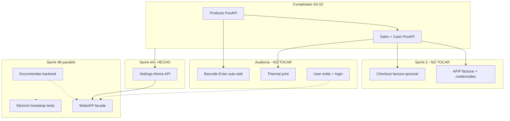

# Análisis próximo sprint (sin solapamiento)

**Fecha:** 2026-06-18  
**Base:** `docs/ai/sprint-revision.md`, `git status`, cambios locales no commiteados.

---

## Resumen ejecutivo

| Área | Estado en repo | Quién lo toca |
|------|----------------|---------------|
| Sprint 3 (AFIP checkout) | Marcado ✅ en doc; archivos `integrations/afip/*` y `AfipCredentialsSettings.tsx` con cambios locales activos | **Agente Sprint 3 — NO TOCAR** |
| Auditoría (barcode, print, auth) | Sin implementar aún en `ProductCatalog`; auth sigue scaffold | **Agente auditoría — NO TOCAR** |
| Sprint 4 secundarios | Tema/logo, encomiendas, WailsAPI, Electron | **Disponible en paralelo** |

**Siguiente sprint recomendado:** **Sprint 4A (3.5)** — persistencia de tema/logo vía API (implementado en esta sesión).

**Sprint 4 completo** puede continuar en paralelo una vez cerrado Sprint 3 y la auditoría.

---

## Zona prohibida (no-touch)

### Sprint 3 — propiedad exclusiva

```
backend/src/integrations/afip/**
frontend/src/app/components/settings/AfipCredentialsSettings.tsx
frontend/src/lib/pos-api.ts  → métodos AFIP (facturar, private-key, certificate)
POSScreen* → flujo voucherType === "factura"
backend/src/api.smoke.test.ts → tests AFIP (no modificar bloques existentes)
```

### Agente auditoría — propiedad exclusiva

```
frontend/src/app/components/pos/ProductCatalog.tsx  → barcode Enter auto-add
frontend/src/app/components/pos/POSScreen*.tsx      → integración scanner
WailsAPI.printReceipt / thermal print
backend/src/auth/** + login UI
docs/ai/sprint-revision.md → sección auditoría extendida
```

---

## Backlog paralelizable (Sprint 4 / 5)

| ID | Tarea | Paralelo con S3 | Paralelo con auditoría | Esfuerzo |
|----|-------|-----------------|------------------------|----------|
| **5.2** | Persistencia tema/logo (`GET/PUT /settings/theme`) | ✅ | ✅ | **1 día** — ✅ hecho |
| **5.1** | Encomiendas: backend `parcels` o ocultar UI | ✅ | ✅ | 2–3 días |
| **5.3** | `WailsAPI` facade sobre `PosAPI` (productos, caja, ventas ya migrados) | ✅ | ⚠️ parcial (print queda Wails) | 2 días |
| **5.4** | Tests Electron bootstrap | ✅ | ✅ | 1–2 días |
| **4.4–4.7** | Auth real: `UserEntity` + bcrypt + JWT + login UI | ✅ | ❌ auditoría | 3–4 días |
| **4.1–4.2** | Barcode scanner Enter → auto-add carrito | ✅ | ❌ auditoría | 0.5–1 día |
| **4.3** | Impresión térmica / recibo (Electron IPC) | ✅ | ❌ auditoría | 2–3 días |
| **0.5** | CodeGraph init (pendiente Sprint 0) | ✅ | ✅ | 0.5 día |

---

## Slice recomendado: Sprint 4A (implementado)

**Objetivo:** que el color primario y logo persistan en SQLite en dev web (antes solo mock en `WailsAPI`).

| Pieza | Cambio |
|-------|--------|
| Backend | `SettingsModule` — `GET/PUT /api/settings/theme` |
| BD | Tabla `theme_settings` (TypeORM sync) |
| Frontend | `PosAPI.getThemeConfig` / `saveThemeConfig` |
| Frontend | `theme-context.tsx` usa `PosAPI` en web, `WailsAPI` en Electron |
| Tests | Smoke `settings theme persistence` en `api.smoke.test.ts` |

**Fuera de alcance 4A:** upload de logo a filesystem (se guarda data-URL en SQLite; suficiente para dev).

---

## Matriz de tests (próximo trabajo)

| Capa | Comando | Cubre |
|------|---------|-------|
| Unit AFIP | `cd backend && npm run test:microservices` | Solo módulo AFIP — agente S3 |
| Smoke API | `npm run dev:api` + `cd backend && npm run test:smoke` | products, sales, cash, **theme**, AFIP |
| Frontend build | `cd frontend && npm run build` | Compilación TS/Vite |
| E2E manual tema | UI Settings → cambiar color → F5 → persiste | 4A |
| Barcode (auditoría) | Manual: escanear EAN en POS con caja abierta | NO implementar aquí |
| Auth (auditoría) | `POST /auth/login` → token real | NO implementar aquí |
| Electron (4.4) | `npm run dev:desktop` smoke | Futuro |

---

## Diagrama de dependencias



---

## Estimación por ítem (días dev)

| Ítem | Días | Notas |
|------|------|-------|
| 4A Tema/logo API | 1 | ✅ Completado |
| 4.1 Encomiendas | 2–3 | CRUD + migración UI o feature flag |
| 4.3 WailsAPI facade | 2 | Delegar a PosAPI lo ya cableado |
| 4.4 Electron tests | 1–2 | CI opcional |
| 5.1 Auth real | 3–4 | Entity, hash, guard JWT real |
| 5.2 Barcode | 0.5–1 | Auditoría |
| 5.3 Print térmico | 2–3 | Auditoría + desktop |
| 0.5 CodeGraph | 0.5 | `codegraph init -i` |

**Total Sprint 4 restante (sin auth/barcode/print):** ~5–7 días en paralelo con cierre S3.

---

## Orden sugerido post-Sprint 3

1. **Merge/cierre Sprint 3** (AFIP en checkout estable).
2. **Sprint 4A** — tema (hecho).
3. **En paralelo:** auditoría (barcode, print, auth) + **4.1 encomiendas** + **4.3 facade**.
4. **Sprint 4.4** Electron tests cuando facade esté listo.

---

## Bitácora

| Fecha | Acción |
|-------|--------|
| 2026-06-18 | Análisis sin solapamiento; implementado Sprint 4A (settings/theme) |
