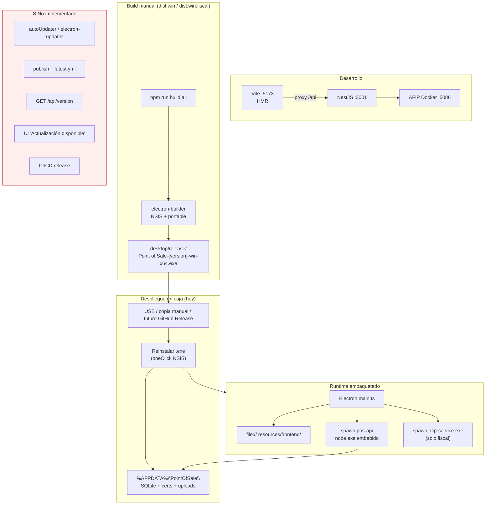

# Auditoría — Arquitectura de actualizaciones / versionado

**Fecha:** 2026-06-18  
**Alcance:** Desktop (Electron), frontend, backend, migraciones SQLite, release monorepo.  
**Excluido:** lógica AFIP (`backend/src/integrations/afip/*`).  
**CodeGraph:** MCP no disponible en esta sesión; verificación vía lectura de código y grep.

---

## Resumen ejecutivo

El monorepo está **bien diseñado para empaquetar y desplegar manualmente** un `.exe` autocontenido (UI + API + Node embebido + sidecar AFIP opcional), pero **no tiene protocolo de actualización automática ni semi-automática**. Hoy el usuario final recibe versiones nuevas **reinstalando el instalador** (USB, copia manual, o — en roadmap — GitHub Release sin pipeline implementado).

No existe concepto de *update armed* (app lista para aplicar parche) ni *update requested* (usuario o sistema solicita descarga/instalación). Tampoco hay endpoint de versión de aplicación, UI de “hay actualización disponible”, canales (stable/beta), ni rollback.

**Veredicto:** arquitectura de **build/deploy** sólida; arquitectura de **actualización** ausente por diseño (MVP).

---

## Estado actual (diagrama)

---

## Evaluación por capa

| Capa | Estado | Hallazgos |
|------|--------|-----------|
| **Desktop (Electron)** | ❌ | `main.ts` solo bootstrap de ventana + servicios locales. Sin `autoUpdater`, sin `electron-updater` en dependencias, sin `publish` en `electron-builder.yml`. Versión `0.0.1` en `desktop/package.json` usada solo en nombres de artefacto. `preload.ts` expone versiones de runtime (Node/Chrome/Electron), no versión de la app. NSIS `oneClick: true` — reinstalación completa, sin protocolo de parche. |
| **Frontend (web embebido)** | ⚠️ | Vite `base: './'` correcto para `file://`. Build genera assets con hash (comportamiento default Vite) → cache bust al **rebuild**. Sin service worker, sin PWA, sin chequeo remoto de versión. En `.exe` la UI es estática en `resources/frontend/` — solo cambia con nuevo instalador. |
| **Backend (API)** | ⚠️ | Prefijo global `api`, sin `/api/v1`. `GET /api` devuelve health (`AppService.getStatus`) sin campo `version`. Swagger `setVersion('1.0.0')` es solo documentación. Sin contrato de compatibilidad entre versiones de cliente y servidor. |
| **BD / migraciones** | ⚠️ | `TypeORM synchronize: true` altera esquema al arrancar. `sqlite-legacy-migrations.ts` tiene **una** migración ad hoc (drop tabla `sales` legacy). `db:init` + arranque en `main.ts` ejecutan legacy migrations. Sin tabla `schema_migrations`, sin versionado semver de esquema, sin rollback. Riesgo al actualizar `.exe` con esquema distinto sobre BD existente en AppData. |
| **Monorepo / release** | ⚠️ | Raíz `0.0.1`; scripts `dist:win` / `dist:win:fiscal` coherentes. Sin `.github/workflows`, sin GitLab CI. README menciona “GitHub Release con .exe versionado” como **roadmap**, no implementado. Distribución documentada: manual (`06-desplegar-caja.md`). |
| **Documentación** | ⚠️ | `build-and-deploy.md` y `desktop/README.md` cubren build y primer arranque, no actualizaciones. No hay runbook de upgrade, rollback ni compatibilidad de BD entre versiones. |

**Leyenda:** ✅ listo · ⚠️ parcial / riesgo · ❌ ausente

---

## Cómo recibe actualizaciones el usuario hoy

1. **Desarrollo:** `npm run dev:stack` — cambios en caliente (Vite HMR + Nest watch). No aplica a cajas.
2. **Producción (.exe):** operador o técnico genera nuevo instalador (`npm run dist:win:fiscal`), lo lleva a la caja (USB, etc.) y **reinstala** encima o desinstala/instala.
3. **Datos:** persisten en `%APPDATA%\PointOfSale\` (SQLite, certificados AFIP, uploads). El nuevo `.exe` reutiliza AppData; el esquema puede mutar vía `synchronize: true` sin migración explícita.
4. **Componentes embebidos:** frontend dist, backend dist + node_modules, `node.exe`, y opcionalmente `afip-service.exe` — todos versionados **juntos** en un solo artefacto. No hay actualización parcial de capas.

No hay:
- Chequeo de actualización al inicio
- Descarga en background
- Notificación “Nueva versión X disponible”
- Canal beta/stable
- Firma de código configurada (`forceCodeSigning: false`)
- Servidor de releases (`publish` en electron-builder)

---

## Protocolos armed / requested — estado

| Concepto | Esperado en apps desktop | Estado POS |
|----------|--------------------------|------------|
| **Check for updates** (solicitud pasiva al iniciar o periódica) | `autoUpdater.checkForUpdates()` o custom feed | ❌ No existe |
| **Update available** (indicación al usuario) | Evento `update-available` → diálogo/banner | ❌ No existe |
| **Update downloaded / armed** (listo para instalar al reiniciar) | `update-downloaded` → “Reiniciar para actualizar” | ❌ No existe |
| **User-requested update** (menú “Buscar actualizaciones”) | Acción manual que dispara check | ❌ No existe |
| **Version endpoint** (cliente compara semver) | `GET /api/version` o manifest remoto | ❌ No existe |
| **Rollback** | Instalador anterior o migración down | ❌ No existe |

---

## Riesgos técnicos actuales

1. **`synchronize: true` en producción:** actualizar el `.exe` puede alterar SQLite sin migración trazable; posible pérdida de datos si TypeORM hace drop/recreate en cambios incompatibles.
2. **Monolito embebido:** cualquier fix de UI o API exige nuevo instalador completo (~cientos de MB con node_modules).
3. **Sin firma de código:** Windows SmartScreen puede advertir; auto-update confía menos sin certificado.
4. **Versiones desincronizadas:** cuatro `package.json` en `0.0.1` sin script de bump unificado.
5. **AFIP sidecar:** en build fiscal, `afip-service.exe` viaja con el instalador; no hay estrategia de actualizar solo el sidecar.

---

## Recomendaciones — Sprint 5 “Actualizaciones”

Estimación en **días-persona** (1 dev familiarizado con el repo). Orden sugerido.

| ID | Tarea | Esfuerzo | Prioridad |
|----|-------|----------|-----------|
| 5.1 | **Versionado unificado:** script `npm run version:bump` que alinee raíz, desktop, frontend, backend; inyectar `APP_VERSION` en build (Vite `define`, Nest env, `electron-builder` desde un solo source) | 0.5 d | Alta |
| 5.2 | **`GET /api/version`** (público): `{ version, schemaVersion, buildDate }` para diagnóstico y futuro check | 0.5 d | Alta |
| 5.3 | **Migraciones formales SQLite:** desactivar `synchronize` en prod, tabla `schema_migrations`, migraciones incrementales (reemplazar/ampliar `sqlite-legacy-migrations`) | 2–3 d | Alta |
| 5.4 | **electron-updater + publish GitHub:** dependencia, bloque `publish` en yml, `latest.yml`, workflow que suba artefactos a Release | 2 d | Alta |
| 5.5 | **Main process:** `checkForUpdates` al boot (delay 30s) + menú “Buscar actualizaciones”; eventos IPC a renderer | 1 d | Alta |
| 5.6 | **UI actualización:** banner o diálogo (versión actual vs nueva, “Descargar”, “Reiniciar e instalar”) | 1 d | Media |
| 5.7 | **CI/CD:** `.github/workflows/release.yml` — tag → build:all → dist:win:fiscal → Release assets | 1.5 d | Media |
| 5.8 | **Canales:** `stable` / `beta` via `electron-updater` channels o repos Release distintos | 0.5 d | Baja |
| 5.9 | **Rollback / compatibilidad:** documentar “no bajar de versión si schemaVersion > X”; backup automático de SQLite pre-migración | 1 d | Media |
| 5.10 | **Firma de código Windows** (certificado EV/OV) para NSIS y auto-update | 1 d (+ cert) | Media |
| 5.11 | **Runbook:** `docs/ai/update-runbook.md` — upgrade en caja, verificación post-update, recuperación | 0.5 d | Media |

**Total estimado Sprint 5:** ~11–12 días-persona (paralelizable en 2 tracks: BD/migraciones vs Electron/CI).

### Quick wins (sin auto-updater completo)

- Mostrar versión de app en Ajustes (leer de `window.desktop` o `/api/version`).
- En `06-desplegar-caja.md`, sección explícita “Procedimiento de actualización manual”.
- Pre-migración: copia de `database.sqlite` antes de `runSqliteLegacyMigrations`.

---

## Referencias de código revisadas

| Archivo | Rol en actualizaciones |
|---------|------------------------|
| `desktop/src/main.ts` | Sin lógica de update |
| `desktop/package.json` | `version`, scripts `dist:win*` |
| `desktop/electron-builder.yml` | Artefactos NSIS/portable; sin `publish` |
| `desktop/src/preload.ts` | Solo runtime versions |
| `desktop/src/local-services.ts` | Health wait; no version check |
| `frontend/vite.config.ts` | `base: './'`; sin SW |
| `backend/src/main.ts` | Legacy migrations al boot |
| `backend/src/database/sqlite-legacy-migrations.ts` | Única migración legacy |
| `backend/src/app.module.ts` | `synchronize: true` |
| `backend/src/app.service.ts` | Health sin `version` |
| `package.json` (raíz) | `dist:win`, `dist:win:fiscal` |
| `docs/ai/build-and-deploy.md` | Build manual |
| `docs/casos-de-uso/06-desplegar-caja.md` | Distribución manual |

---

## Conclusión: ¿está bien diseñada?

| Dimensión | Valoración |
|-----------|------------|
| Empaquetado monolítico para caja offline | ✅ Buena |
| Separación dev (stack) vs prod (`.exe`) | ✅ Clara |
| Persistencia AppData entre “versiones” | ✅ Correcta |
| Protocolo de actualización (armed/requested) | ❌ Inexistente |
| Seguridad y trazabilidad de migraciones BD | ❌ Insuficiente para upgrades frecuentes |
| Pipeline de release | ❌ Manual |

**Respuesta honesta:** la estructura **sí** está bien pensada para un **MVP instalable manualmente**; **no** está diseñada aún para que la aplicación **reciba actualizaciones** de forma controlada. Eso es coherente con el roadmap del README (GitHub Release pendiente) y Sprint 4 (desktop secundario). El siguiente salto de madurez es Sprint 5: versionado + migraciones + electron-updater + CI.
